 
  <h1>Groovy Clone</h1>
   
  
 This project is a replica of the Groovy website. The goal is to showcase skills in web development and user interface design. <a title="Click Here"     target="_blank" href="https://groovy-clone.nicolasdelrosario.com">click here</a>

  

  

<h2>| Technologies Used</h2>
<ul>
  <li>HTML</li>
  <li>CSS</li>
  <li>SCSS</li>
  <li>Bootstrap</li>
  <li>Bootstrap Icons</li>
  <li>JavaScript</li>
  <li>Cloudinary: Image Storage</li>
</ul>

<h2>| License</h2>

This project is available under the MIT license. See the <b><a title="License" target="_blank" href="https://choosealicense.com/licenses/mit/">LICENSE</a></b> 

<h2>| Author</h2>

This project was created by <b>Nicolas Del Rosario.</b> You can find more information about me on <a title="linkedin" target="_blank" href="https://www.linkedin.com/in/nicolasdelrosario/">Linkedin</a>, <a title="linkedin" target="_blank" href="https://github.com/nicolasdelrosario">Github</a>

